# 🍽️ Vite & Gourmand

> Eco-responsible catering web application — full-stack project for the DWWM certification (ECF).


Application de commande de menus traiteur événementiel pour l'entreprise Vite & Gourmand (Bordeaux).
Engagement éco-responsable, anti-gaspillage, partenaires locaux.

---

## 📋 Table of contents

- [🍽️ Vite \& Gourmand](#️-vite--gourmand)
  - [📋 Table of contents](#-table-of-contents)
  - [🚀 Tech stack](#-tech-stack)
  - [📦 Local installation](#-local-installation)
  - [🔑 Test credentials](#-test-credentials)
  - [📐 Documentation](#-documentation)
    - [MVC Architecture](#mvc-architecture)
    - [Use case diagram](#use-case-diagram)
    - [Sequence diagram — Order workflow](#sequence-diagram--order-workflow)
    - [Class diagram](#class-diagram)
    - [Database model — MCD (Merise notation)](#database-model--mcd-merise-notation)
    - [Database model — ERD (Mermaid)](#database-model--erd-mermaid)
  - [🌱 Eco-responsible vision](#-eco-responsible-vision)
  - [🔗 Project links](#-project-links)
  - [📁 Project structure](#-project-structure)
  - [👤 Author](#-author)

---

## 🚀 Tech stack

| Layer              | Technology                              |
| ------------------ | --------------------------------------- |
| Front-end          | HTML5, CSS3, Vanilla JavaScript         |
| Back-end           | PHP 8.3 with PDO                        |
| Relational DB      | MySQL 8.4                               |
| NoSQL DB           | MongoDB 8                               |
| Email service      | PHPMailer + Mailpit (development)       |
| Local environment  | Laragon                                 |
| Deployment         | fly.io                                  |
| Project management | Notion                                  |
| Design             | Figma                                   |
| UML diagrams       | PlantUML                                |
| Versioning         | Git + GitHub                            |

---
## 📦 Local installation

```bash
# Clone the repository
git clone https://github.com/Biba-Com/vite-et-gourmand.git
cd vite-et-gourmand

# Install PHP dependencies
composer install

# Configure environment variables
cp .env.example .env
# Then edit .env with your local credentials

# Initialize the database
mysql -u root -p < database/create.sql
mysql -u root -p < database/fixtures.sql
```
---

## 🔑 Test credentials

| Role     | Email                          | Password       |
| -------- | ------------------------------ | -------------- |
| Admin    | admin@vite-et-gourmand.fr      | Admin@2026     |
| Employee | employe@vite-et-gourmand.fr    | Employe@2026   |
| Client   | client@vite-et-gourmand.fr     | Client@2026    |

---
## 📐 Documentation

### MVC Architecture

The application follows the Model-View-Controller design pattern, ensuring clean separation of concerns.


📄 [PlantUML source](docs/uml/architecture-mvc.puml)

### Use case diagram

37 use cases distributed across 4 actors with inheritance (Visiteur → Utilisateur → Employé → Administrateur).


📄 [PlantUML source](docs/uml/usecase.puml)

### Sequence diagram — Order workflow

Detailed workflow for placing a multi-service order, including server-side security, database transactions, distance caching, and email notifications.


📄 [PlantUML source](docs/uml/sequence-commande.puml)

### Class diagram

Complete application architecture with 29 classes organized into 7 modules:
1. **Users & Authentication** — User, Session, PasswordResetToken
2. **Catalog** — Menu, Dish, Service, Allergen, Theme, Diet, EcoBadge
3. **Orders** — Order, OrderItem, DistanceCache
4. **Reviews** — Review with moderation workflow
5. **Eco-responsible vision** — AntiWasteOffer, Partner, Certification, AlertSubscription
6. **System** — TeamMember, OpeningHours, RseContent
7. **Audit & Traceability** — OrderStatusHistory, ContactMessage, EmailLog, Notification, AuditLog


📄 [PlantUML source](docs/uml/classe.puml)

### Database model — MCD (Merise notation)

Conceptual data model with 31 entities organized across 7 modules.


📄 [PlantUML source](docs/uml/mcd.puml)

---

### Database model — ERD (Mermaid)

Interactive entity relationship diagram rendered natively by GitHub.

```mermaid
erDiagram
    UTILISATEUR ||--o{ SESSION : "possede"
    UTILISATEUR ||--o{ TOKEN_MOT_DE_PASSE : "demande"
    UTILISATEUR ||--o{ COMMANDE : "passe"
    UTILISATEUR ||--o{ AVIS : "redige"
    UTILISATEUR ||--o{ ABONNEMENT_ALERTE : "souscrit"
    UTILISATEUR ||--o{ NOTIFICATION : "recoit"
    UTILISATEUR ||--o{ CONTENU_RSE : "modifie"
    UTILISATEUR ||--o{ HISTORIQUE_STATUT : "effectue"
    UTILISATEUR ||--o{ LOG_AUDIT : "trace"
    UTILISATEUR ||--o{ MESSAGE_CONTACT : "assigne_a"
    
    THEME ||--o{ MENU : "categorise"
    MENU ||--o{ COMPOSITION_MENU : "compose"
    PLAT ||--o{ COMPOSITION_MENU : "appartient"
    PLAT ||--o{ PLAT_ALLERGENE : "contient"
    ALLERGENE ||--o{ PLAT_ALLERGENE : "present"
    MENU ||--o{ MENU_REGIME : "respecte"
    REGIME ||--o{ MENU_REGIME : "applique"
    MENU ||--o{ MENU_BADGE_ECO : "etiquete"
    BADGE_ECO ||--o{ MENU_BADGE_ECO : "applique"
    MENU ||--o{ MENU_CERTIFICATION : "certifie"
    CERTIFICATION ||--o{ MENU_CERTIFICATION : "valide"
    
    COMMANDE ||--|{ LIGNE_COMMANDE : "contient"
    MENU ||--o{ LIGNE_COMMANDE : "reference"
    SERVICE ||--o{ LIGNE_COMMANDE : "reference"
    OFFRE_ANTI_GASPI ||--o{ LIGNE_COMMANDE : "vendue_via"
    COMMANDE ||--o| AVIS : "concerne"
    COMMANDE ||--o{ HISTORIQUE_STATUT : "trace"
    MENU ||--o{ OFFRE_ANTI_GASPI : "concerne"
```



📄 [Full ERD with architecture notes](docs/uml/erd-mermaid.md)

---

## 🌱 Eco-responsible vision

This application includes features beyond the standard catering scope to support sustainability:

- **RSE page** — environmental commitments and carbon footprint
- **Certifications** — organic and eco-friendly labels
- **Local partners** — short-circuit suppliers
- **Anti-waste offers** — discounted menus to reduce food waste
- **Eco badges** on each menu (local, zero-waste, vegetarian)

---

## 🔗 Project links

- 🌐 Live application: *(coming soon)*
- 📋 Notion project board: *(coming soon)*
- 🎨 Figma mockups: *(coming soon)*

---

## 📁 Project structure

\```
vite-et-gourmand/
├── database/                # SQL scripts (create.sql, fixtures.sql)
├── docs/
│   ├── maquettes/           # Figma exports
│   └── uml/                 # PlantUML diagrams
│       └── exports/         # PNG/SVG outputs
├── src/
│   ├── config/              # DB connection, constants
│   ├── controllers/         # MVC — business logic
│   ├── models/              # MVC — database access
│   ├── views/               # MVC — HTML/PHP templates
│   ├── utils/               # Helper functions
│   └── public/              # Web entry point + assets
├── .env.example             # Environment variables template
├── .gitignore
└── README.md
\```

---

## 👤 Author

**Biba-Com** — Web and Mobile Web Developer student
DWWM certification — STUDI 2025/2026