# ERD - Vite & Gourmand

> Entity Relationship Diagram (ERD) using Mermaid notation
> 31 entities across 7 modules 

```mermaid
erDiagram
    UTILISATEUR ||--o{ SESSION : "possede"
    UTILISATEUR ||--o{ TOKEN_MOT_DE_PASSE : "demande"
    UTILISATEUR ||--o{ COMMANDE : "passe"
    UTILISATEUR ||--o{ AVIS : "redige"
    UTILISATEUR ||--o{ ABONNEMENT_ALERTE : "souscrit"
    UTILISATEUR ||--o{ NOTIFICATION : "recoit"
    UTILISATEUR ||--o{ CONTENU_RSE : "modifie"
    UTILISATEUR ||--o{ HISTORIQUE_STATUT : "effectue"
    UTILISATEUR ||--o{ LOG_AUDIT : "trace"
    UTILISATEUR ||--o{ MESSAGE_CONTACT : "assigne_a"
    
    THEME ||--o{ MENU : "categorise"
    MENU ||--o{ COMPOSITION_MENU : "compose"
    PLAT ||--o{ COMPOSITION_MENU : "appartient"
    PLAT ||--o{ PLAT_ALLERGENE : "contient"
    ALLERGENE ||--o{ PLAT_ALLERGENE : "present"
    MENU ||--o{ MENU_REGIME : "respecte"
    REGIME ||--o{ MENU_REGIME : "applique"
    MENU ||--o{ MENU_BADGE_ECO : "etiquete"
    BADGE_ECO ||--o{ MENU_BADGE_ECO : "applique"
    
    MENU ||--o{ MENU_CERTIFICATION : "certifie"
    CERTIFICATION ||--o{ MENU_CERTIFICATION : "valide"
    
    COMMANDE ||--|{ LIGNE_COMMANDE : "contient"
    MENU ||--o{ LIGNE_COMMANDE : "reference"
    SERVICE ||--o{ LIGNE_COMMANDE : "reference"
    OFFRE_ANTI_GASPI ||--o{ LIGNE_COMMANDE : "vendue_via"
    
    COMMANDE ||--o| AVIS : "concerne"
    COMMANDE ||--o{ HISTORIQUE_STATUT : "trace"
    
    MENU ||--o{ OFFRE_ANTI_GASPI : "concerne"

    UTILISATEUR {
        int id_utilisateur PK
        string email UK
        string mot_de_passe
        string nom
        string prenom
        string telephone
        string adresse
        string code_postal
        string ville
        enum role
        boolean is_active
        datetime created_at
        datetime updated_at
        datetime deleted_at
    }
    
    SESSION {
        string id_session PK
        int id_utilisateur FK
        string csrf_token
        string ip_address
        string user_agent
        datetime last_activity
        datetime created_at
    }
    
    TOKEN_MOT_DE_PASSE {
        int id_token PK
        int id_utilisateur FK
        string token_hash
        datetime expires_at
        datetime used_at
        datetime created_at
    }
    
    MENU {
        int id_menu PK
        int id_theme FK
        string titre
        text description
        decimal prix_par_personne
        int nb_personnes_min
        int nb_personnes_max
        string image_url
        boolean is_active
        datetime created_at
        datetime updated_at
    }
    
    PLAT {
        int id_plat PK
        string nom
        text description
        enum categorie
        string image_url
        boolean is_active
        datetime created_at
    }
    
    ALLERGENE {
        int id_allergene PK
        string nom UK
        string icone
    }
    
    THEME {
        int id_theme PK
        string nom UK
        text description
        string couleur
    }
    
    REGIME {
        int id_regime PK
        string nom UK
        text description
    }
    
    SERVICE {
        int id_service PK
        string nom
        text description
        enum categorie
        decimal prix_base
        enum unite_tarification
        boolean is_active
        datetime created_at
    }
    
    COMPOSITION_MENU {
        int id_menu PK_FK
        int id_plat PK_FK
        int quantite
        int ordre_affichage
    }
    
    PLAT_ALLERGENE {
        int id_plat PK_FK
        int id_allergene PK_FK
    }
    
    MENU_REGIME {
        int id_menu PK_FK
        int id_regime PK_FK
    }
    
    MENU_BADGE_ECO {
        int id_menu PK_FK
        int id_badge PK_FK
    }
    
    MENU_CERTIFICATION {
        int id_menu PK_FK
        int id_certification PK_FK
    }
    
    COMMANDE {
        int id_commande PK
        int id_utilisateur FK
        datetime date_evenement
        string adresse_livraison
        string code_postal_livraison
        string ville_livraison
        decimal distance_km
        int nb_personnes
        decimal sous_total
        decimal montant_remise
        decimal frais_livraison
        decimal total
        enum statut
        text motif_annulation
        datetime annulee_a
        datetime created_at
        datetime updated_at
    }
    
    LIGNE_COMMANDE {
        int id_ligne PK
        int id_commande FK
        int id_menu FK
        int id_service FK
        int id_offre FK
        int quantite
        int duree_heures
        decimal prix_unitaire
        decimal sous_total
        text notes
    }
    
    CACHE_DISTANCE {
        int id_cache PK
        string ville UK
        decimal distance_km
        datetime cached_at
        datetime expires_at
    }
    
    AVIS {
        int id_avis PK
        int id_utilisateur FK
        int id_commande FK
        int note
        text commentaire
        enum statut
        int id_moderateur FK
        datetime moderated_at
        text motif_moderation
        datetime created_at
    }
    
    BADGE_ECO {
        int id_badge PK
        string nom UK
        text description
        string icone
        string couleur
    }
    
    OFFRE_ANTI_GASPI {
        int id_offre PK
        int id_menu FK
        string titre
        text description
        decimal prix_original
        decimal prix_remise
        int quantite_disponible
        datetime disponible_jusqua
        boolean is_active
        datetime created_at
    }
    
    ABONNEMENT_ALERTE {
        int id_abonnement PK
        int id_utilisateur FK
        enum type_alerte
        boolean is_active
        datetime created_at
    }
    
    CERTIFICATION {
        int id_certification PK
        string nom
        text description
        string logo_url
        string organisme
        date date_validite
        boolean is_active
    }
    
    PARTENAIRE {
        int id_partenaire PK
        string nom
        text description
        string logo_url
        string site_web
        enum categorie
        boolean is_active
    }
    
    MEMBRE_EQUIPE {
        int id_membre PK
        string nom
        string prenom
        string poste
        text bio
        string photo_url
        int ordre_affichage
        boolean is_active
    }
    
    HORAIRES_OUVERTURE {
        int id_horaire PK
        enum jour_semaine
        time heure_ouverture
        time heure_fermeture
        boolean is_ferme
        date date_speciale
        string notes
    }
    
    CONTENU_RSE {
        int id_contenu PK
        string cle_section UK
        string titre
        text contenu
        string image_url
        int ordre_affichage
        int id_utilisateur_maj FK
        datetime updated_at
    }
    
    HISTORIQUE_STATUT {
        int id_historique PK
        int id_commande FK
        string statut_precedent
        string nouveau_statut
        int id_utilisateur FK
        text motif
        datetime created_at
    }
    
    MESSAGE_CONTACT {
        int id_message PK
        string nom_expediteur
        string email_expediteur
        string telephone_expediteur
        string sujet
        text message
        enum statut
        int id_assigne FK
        datetime repondu_a
        datetime created_at
    }
    
    LOG_EMAIL {
        int id_log PK
        string destinataire
        string sujet
        string template
        enum statut
        text message_erreur
        string type_entite
        int id_entite
        datetime envoye_a
        datetime created_at
    }
    
    NOTIFICATION {
        int id_notification PK
        int id_utilisateur FK
        enum type
        string titre
        text message
        string lien_url
        boolean is_read
        datetime read_at
        datetime created_at
    }
    
    LOG_AUDIT {
        int id_audit PK
        int id_utilisateur FK
        enum action
        string type_entite
        int id_entite
        json anciennes_valeurs
        json nouvelles_valeurs
        string ip_address
        string user_agent
        datetime created_at
    }
```

## Notation Mermaid

| Symbole | Signification |
|---------|---------------|
| `\|\|--o{` | Un à plusieurs (1,n) |
| `\|\|--\|{` | Un à plusieurs obligatoire (1..n) |
| `\|\|--o\|` | Un à un optionnel (0,1) |
| `PK` | Primary Key |
| `FK` | Foreign Key |
| `UK` | Unique Key |
| `PK_FK` | Clé composite (PK + FK) |

## Design decisions and architecture notes

### LIGNE_COMMANDE — Anti-waste offer tracking
The `id_offre` column (nullable FK) links a line item to a specific 
anti-waste promotion. This enables:
- Automatic decrement of `quantite_disponible` on purchase
- Accurate anti-waste sales reporting in MongoDB
- Distinction between regular and promotional purchases

### MENU_CERTIFICATION — Eco-label association
Join table linking certifications to menus. This supports:
- Display of eco-labels (Bio, Ecocert, AOP) on menu cards
- Filtering catalog by certification type
- Highlighting the company's eco-responsible commitments

### LIGNE_COMMANDE — Price snapshot pattern
The `prix_unitaire` column stores the price at order time.
If menu prices change later, historical order amounts remain intact.
Essential for accounting integrity and dispute resolution.

### CACHE_DISTANCE — Maps API optimization
Caches computed distances between Bordeaux and delivery cities.
Avoids redundant paid API calls for recurring destinations.
Cache refresh policy: 90 days.

### UTILISATEUR — Role management
Current implementation uses ENUM (visitor, client, employee, admin).
This is intentional for this version — 4 fixed roles, simple auth.

**Future evolution**: Full RBAC architecture with ROLE, PERMISSION,
UTILISATEUR_ROLE and ROLE_PERMISSION tables if permission 
complexity grows.

### LOG_AUDIT — JSON columns
`anciennes_valeurs` and `nouvelles_valeurs` use MySQL JSON type.
Requires MySQL 5.7+ (currently using MySQL 8.4 ✅).
Enables efficient querying of delta changes per audit entry.

### mot_de_passe — Hashing compatibility
Column typed VARCHAR(255) to support modern hashing algorithms
(BCrypt, Argon2id) which produce variable-length outputs.

## Technical stack compatibility

| Feature | Requirement | Current |
|---------|-------------|---------|
| JSON type | MySQL 5.7+ | MySQL 8.4 ✅ |
| Soft delete | Application level | deleted_at ✅ |
| Transactions | InnoDB engine | MySQL default ✅ |
| Unicode | utf8mb4 charset | Configured ✅ |

## Statistics

- **31 entities** total
- **7 logical modules**
- **~33 relationships**
- **5 join tables**: composition_menu, plat_allergene, menu_regime, menu_badge_eco, menu_certification